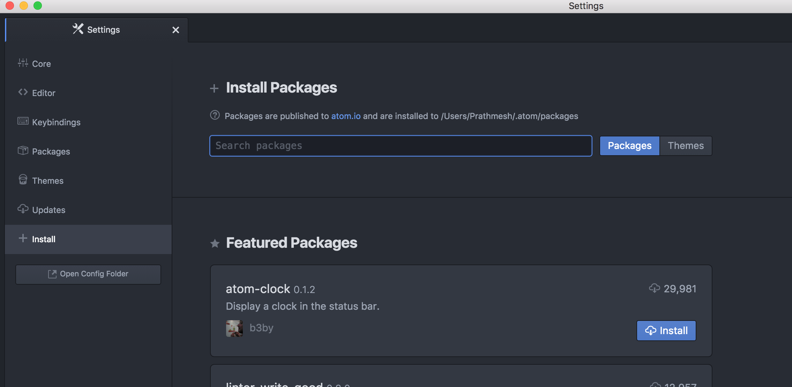
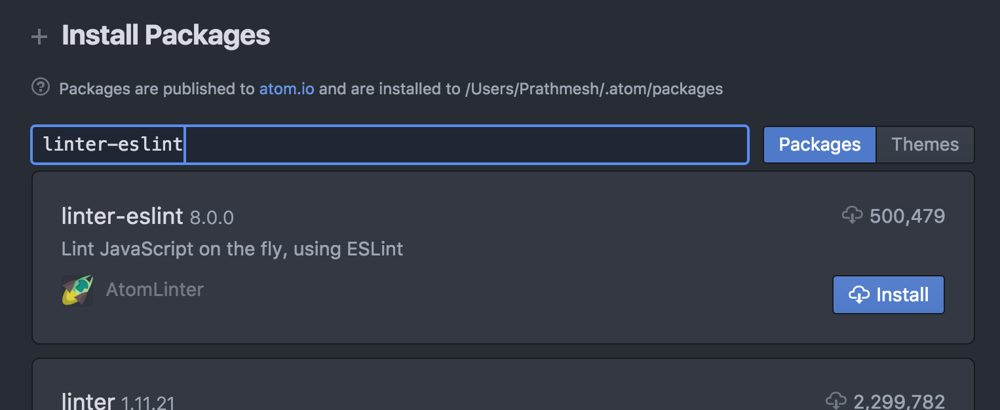
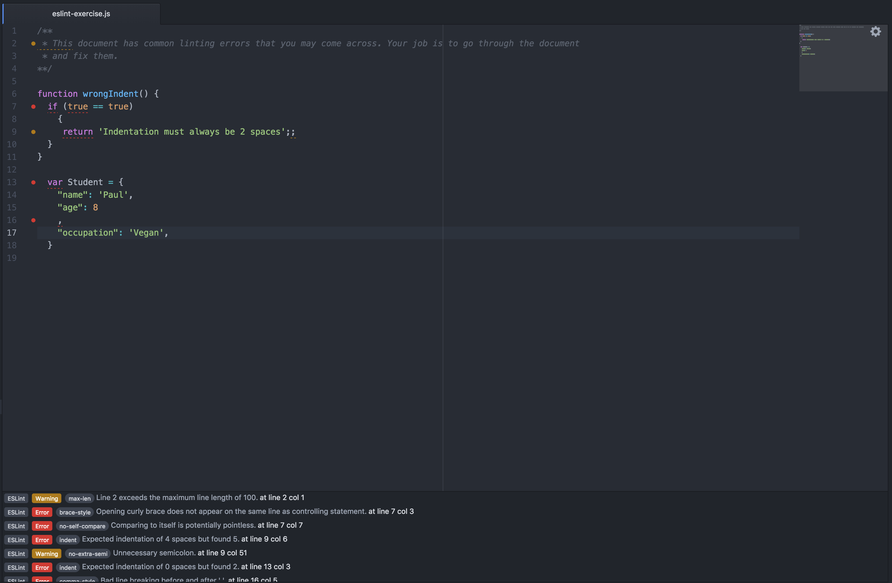

# Atom
Atom is an open source, customizable text editor. People from all around the world write plugins/packages to add more functionality to the editor (i.e. a linter to make sure you are using correct syntax when writing code). These addons make it the perfect tool for programmers. This guide will help you download Atom and set it up for use in this course.

## Getting Started
1. Go to [https://atom.io/](https://atom.io/) and press the **Download For Mac/Download Windows Installer** button.

1. Once downloaded:
   - If you are on Windows run the .exe installer and install Atom
   - If you are on Mac move the Atom App to your Applications folder

1. Open Atom. You should see the Welcome Screen the first time you open the text editor.

1. Go to Atom -> Preferences

1. Go to the `+ Install` tab

1. Search for `linter-eslint` where it says **Search packages**.

1. Install the package titled `linter-eslint` by *AtomLinter*. Once you press the **Install** button the installation will happen in the background.

1. Make sure the linter (defined below) package has been installed by going to the `Packages` tab in Atom Preferences. `linter-eslint` should be under **Community Packages**.
  - **Lint**/**Linter:** a program that checks source code for Stylistic and Programmatic errors. This helps keep your code clean, and minimizes mistakes made during coding. They exist for all programming languages, not just Javascript. The code block below is an example of possible linting errors.

  ```javascript
  /* eslint comma-style: ["error", "last"] */
  var foo = 1
  ,
  bar = 2; // PLACE ON ONE LINE

  if (true) {
     return; // INDENTATION MUST BE 2 SPACES
  }
  ```

Congratulations! You have performed the minimal Atom setup required for this course.

#### Exercise
Navigate to [week01/day1/eslint-exercise.js](./eslint-exercise.js). Open it and make sure the errors are being recognized (if not, then make sure you followed the above instructions properly). Once open and error ridden, go through the file and try fix the linting errors. 
