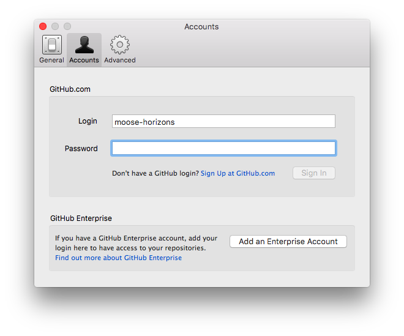
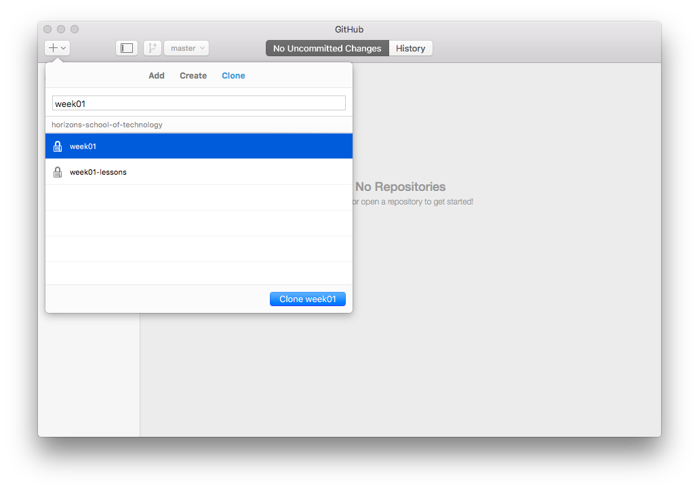
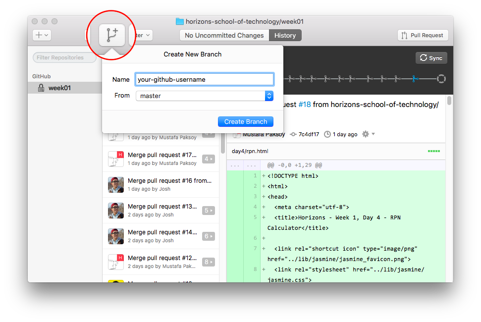
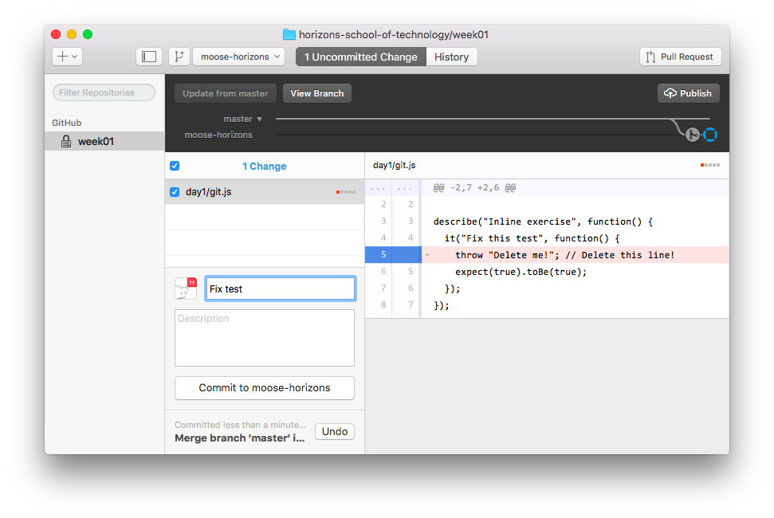
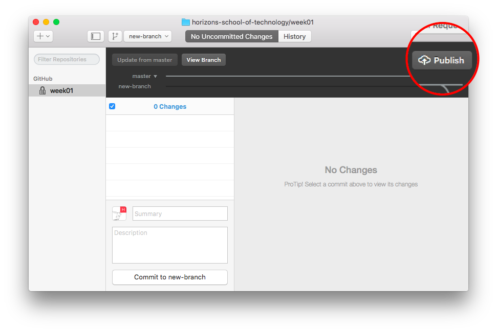

# Inline Exercise: Setting up Git and GitHub

## Goal

The goal of this exercise to get setup with Git and GitHub. You need Git and GitHub to access Horizons course materials and share your work with us.

## Instructions

1. [Install GitHub Desktop Client](https://desktop.github.com/)
1. Login with your GitHub username and password
   
1. Clone the repository `week01`
   
1. Create a branch with your GitHub username
   
1. Open `week01/day1/git.html` and see test failure
1. Open `week01/day1/git.js` in and fix the code
1. `commit` your changes to Git
   
1. Sync (i.e. `push`) your changes to GitHub
   

Congratulations! You've completed your first inline assignment.
