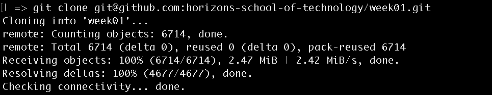
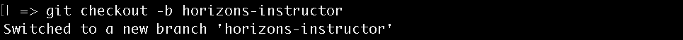
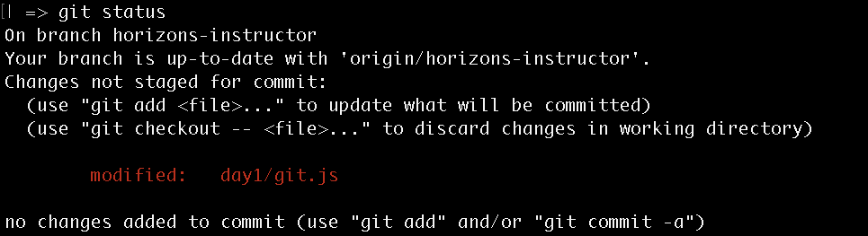
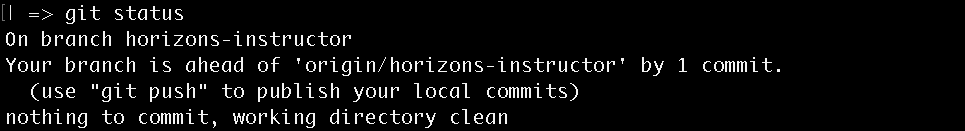
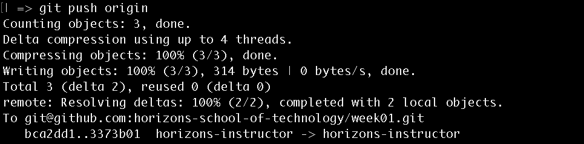
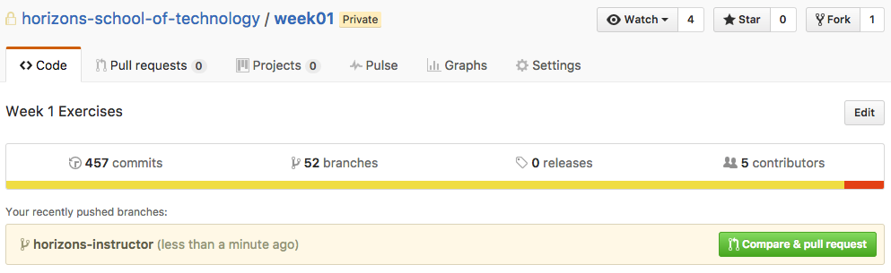
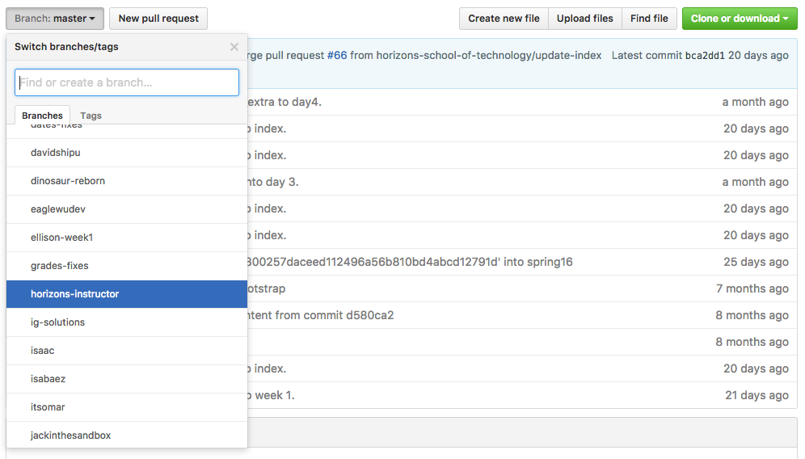

# Git Overview

## What is Git
Git is a tool used for keeping track of changes in projects (i.e. Computer Program). It is used on projects of all sizes to store the history of changes made. All of the information for the repository (commit history) is stored in a file named `.git` at the root of your project. A git repository can be hosted on your local computer or even online (i.e. on Github).

### Git Clone
Copies a Remote Git Repository to your local machine.

### Git Checkout
Creates a new branch. A branch is a copy of your code that you can modify without affecting the original. You will use branches to keep track of your own work keeping it separate from your peers.

### Git Status
Allows you to see any/all changes made to the project.

### Git Commit
Whenever a file has been changed you have to *commit* it. A commit saves the changes made to the file (locally), along with information like:
- Name of User that changed file
- Time of the change
- An ID unique to each commit
- A small description of the changes made
- Number of lines changed
- List of files updated

### Git Push
Saves your commits to the remote repository.

### Git Stash
Temporarily saves changes made to the project, and resets to the last commit. Changes can be reapplied at any time using `git stash pop`.

# Inline Exercise: Setting up Git and GitHub

## Goal

The goal of this exercise to get setup with Git and GitHub. You need Git and
GitHub to access Horizons course materials and share your work with us.

## Mac Instructions

1. Open your Terminal, it's located in `/Applications/Utilities/Terminal.app`
1. [Download and install Git for Mac](https://git-scm.com/download/mac)
1. [Create a new SSH key](https://help.github.com/articles/generating-a-new-ssh-key-and-adding-it-to-the-ssh-agent/#platform-mac)
1. [Add the SSH key to your GitHub account](https://help.github.com/articles/adding-a-new-ssh-key-to-your-github-account/#platform-mac)

## Windows Instructions

1. [Download and install Git for Windows](https://git-for-windows.github.io/)
1. Open Git Bash
1. [Create a new SSH key](https://help.github.com/articles/generating-a-new-ssh-key-and-adding-it-to-the-ssh-agent/#platform-windows)
1. [Add the SSH key to your GitHub account](https://help.github.com/articles/adding-a-new-ssh-key-to-your-github-account/#platform-windows)

## Getting Started with Git

1. Create a new directory for Horizons course material.

  ```bash
  mkdir Horizons
  cd ./Horizons
  ```

1. Clone the `week01` repository

  ```bash
  git clone git@github.com:horizons-school-of-technology/week01.git
  ```

  This creates a local version of the `week01` course material for you to work on.
  

1. Change working directory into `week01`

  ```bash
  cd ./week01
  ```

1. Create your own branch

  ```bash
  git checkout -b your-branch-name-here
  ```

  Creating a branch with your name allows you to make your own changes, and submit them without interfering with anyone else's code.
  

1. Set-up your Git environment

  ```bash
  bash setup.sh
  ```

1. Push your branch to GitHub

  ```bash
  git push -u origin
  ```

1. Open `week01/day1/git.js` in and fix the code

1. Check Repository Status

  ```bash
  git status
  ```

  This will display the files that have been modified.
  

1. Commit your changes

  ```bash
  git commit -am "Fix code"
  ```

Locally saves the changes you made to `week01/day1/git.js` and titles the commit 'Fix Code'

1. Check Repository Status

  ```bash
  git status
  ```

  This is a good way to check whether or not all of your changes have been committed.
  

1. Push your changes again

  ```bash
  git push origin
  ```
  

  Allows you to store your changes on the Horizons Github Repo (origin). This will make your work public and accessible via Github.

## Github Results

After following steps 4 - 6, `www.github.com` will notify you of your newly created branch on the repository with a banner as displayed in the figure below. Our sample branch is named `horizons-instructor`.


&nbsp;

The dropdown shown below will list all branches in this repository. In this case you will see the branches created by fellow students.


Congratulations! You're ready to complete Horizons exercises.
