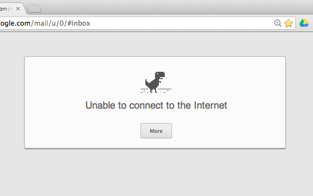
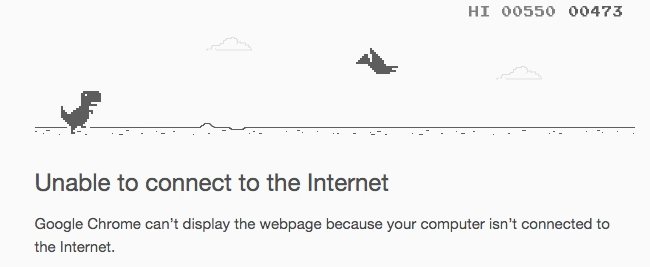
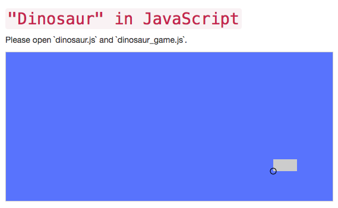

# Dinosaur Game

## Introduction

When Google Chrome is unable to connect to the internet it
displays this screen.



If you hit the <kbd>Space</kbd> it turns into a game.



For this exercise, we're re-make this game.
[Go ahead and try it!](http://apps.thecodepost.org/trex/trex.html)

## Your `Canvas`

We will be drawing our game in a box 550 pixels wide and 250 pixels high.
This box is backed by a browser element called `canvas`. The coordinate
system for canvases is slightly different than what you may have seen
before. Positive X's are right and negative X's are left, just like usual,
but positive Y's are down, rather than up. This picture might describe it
best for you:


So the bigger your Y value, the farther down you'll be!

## Your tasks

### Part 0: Getting started

1. Open `dinosaur.js` in your text editor, your code will go here.
1. Open `dinosaur_game.js` in your text editor, these are the functions you will use to build the game. (See *All in the `game`* below for full documentation.)
1. Open `dinosaur.html` in your browser.

When you're done you should see this:



### Part 1: Moving obstacle

#### You will need

- [setInterval()](http://www.w3schools.com/jsref/met_win_setinterval.asp)
- `game.clear()`
- `game.drawObstacle()`
- `game.width`

#### Steps

1. Write a function called `eventLoop()` that clears the screen with
  `game.clear()` and draws the obstacle 10 pixels to the left of where it used
  to be. You'll need to remember use a variable outside the function to remember
  the location of the obstacle so you can recalculate its new location.

  ```javascript
  game.onReady(function() {
    var obstacleX = 450;
    function eventLoop() {
      obstacleX = obstacleX - 10; // move obstacle 10 pixels leftmost
      // clear screen
      // draw obstacle again
    }
  });
  ```

1. Use`setInterval()` to run this loop run every 100ms (i.e. 10 times/second).

  ```javascript
  setInterval(eventLoop, 100);
  ```
1. Inside `eventLoop()`, when the obstacle reaches the leftmost side of the screen
  (x coordinate of `0`), move it to the rightmost side of the screen (x
  coordinate of `game.width`).

When you're done you should see this:


### Part 3: Jumping dinosaur

#### You will need

- `game.drawDinosaur()`
- `game.onUpArrow()`

#### Steps

1. Create a variable outside `eventLoop()` called `dinosaurY` and set it to 200.
  Use this variable to draw the Dinosaur inside `eventLoop` with
  `game.drawDinosaur(100, dinosaurY)`
1. Create a variable outside `eventLoop()` called `dinosaurVelocity` and set
  it to 0. Inside `eventLoop()` subtract the value of `dinosaurVelocity` from
  `dinosaurY`. (Y coordinates grow as you go further down the page.)

  ```javascript
  dinosaurY = dinosaurY - dinosaurVelocity;
  ```

1. When the user presses the up arrow, set `dinosaurVelocity` to `10`. Watch
  your dinosaur fly.

  ```javascript
  game.onUpArrow(function() {
    dinosaurVelocity = 10;
  });
  ```

1. Now bring your dinosaur back to earth. Inside `eventLoop()`, if
  `dinosaurY` is less than `100`, set `dinosaurVelocity` to `-10`.
1. Now prevent your dinosaur from going underground. Inside `eventLoop`,
  if `dinosaurY` is greater than `200`, set `dinosaurVelocity` to `0` and
  `dinosaurY` to `200`;

When you're done you should see this:


### Part 3: Dinosaur collision

#### You will need

- [clearInterval()](http://www.w3schools.com/jsref/met_win_clearinterval.asp)
- `game.drawText()`

#### Steps

1. Create a variable and save the return value of the `setInterval()` call
  you made earlier.

  ```javascript
  var interval = setInterval(eventLoop, 100);
  ```

1. Inside `eventLoop()`, if the x, y coordinates of the dinosaur and
  the obstacle are the same, then display a message telling the user
  they have lost with `game.drawText('You lose :(')` and stop the game
  with `clearInterval(interval)`.

When you're done you should see this:


### Part 4: Keeping score

#### You will need

- `game.drawScore()`

#### Steps

1. Create a variable outside `eventLoop()` called `score` and initialize it to
  `0`.
1. Each time `eventLoop()` is called increase `score` by 1 and display it
  using `game.drawScore()`.

TODO

### Part 5: Restarting games

If the user presses up when the game is over (i.e. after dinosaur and
obstacle have collided), restart the game by resetting the score, the
coordinates of the dinosaur and the obstacle and then running `setInterval()`
again.

TODO

### Part 6: High score

#### You will need

- `game.drawHighScore()`
- `game.getHighScore()`
- `game.saveHighScore()`

#### Steps

1. Outside `eventLoop()`, look up the last high score with `game.getHighScore()`
  and save it in a variable `highScore`.
1. Inside `eventLoop()` if `score` is greater than `highScore` update `highScore`
  and save it with `game.saveHighScore()`.
1. Inside `eventLoop()` display the high score with `drawHighScore()`.

TODO

### (Bonus) Part 6: Better collisions

Right now we only detect collisions if the lower-left corner of the dinosaur
and the obstacle are in exact the same spot. We should detect if dinosaur and
obstacle are colliding by checking if their rectangles overlap at all.
Use the
[Axis Aligned Bounding Box algorithm](https://developer.mozilla.org/en-US/docs/Games/Techniques/2D_collision_detection)
to do this.

### (Bonus) Part 5: Basic physics

Make the dinosaur decelerate smoothly when it's in the air. You can achieve
this effect by checking if `dinosaurY` is less than `200` and reducing
`dinosaurVelocity` at each step.

Experiment with gravity by changing the initial speed and the acceleration factor.

### (Bonus) Part 7: Smoother animations

Use the browser built-in `requestAnimationFrame()` function to make the
animations more smooth.
[This link](http://creativejs.com/resources/requestanimationframe/) explains
how!

---

### All in the `game`

To make the game, we're providing you with functions to make interacting with
the browser easier. These functions are available under the global object
`game`. They are found in the file `dinosaur_game.js`.

There are only a few methods implemented but they make your life a lot easier:

##### `CanvasWrapper.prototype.height`

This number represents the height of the game board in pixels.

##### `CanvasWrapper.prototype.width`

This number represents the width of the game board in pixels.

##### `CanvasWrapper.prototype.dinosaurHeight`

This number represents the height of a dinosaur in pixels.

##### `CanvasWrapper.prototype.dinosaurWidth`

This number represents the width of a dinosaur in pixels.

##### `CanvasWrapper.prototype.clear()`

This method clear the canvas. The Canvas Element works like a real canvas - once you've painted something, it will stay there. That feature is annoying if you're building a game and want to move things around - the old image will stay where you drew it last, and so you see a 'lagging' sort of effect.

Kind of like this:


So, when you want to move objects, you have to clear the canvas before you do, otherwise it's Windows 95 all over again.

##### `CanvasWrapper.prototype.drawDinosaur(x<Number>, y<Number>)`

This method draws the `Dinosaur` object to the screen. Really, it's just an orange-redish (coral?) rectangle, but it's the thought that counts. It will draw a rectangle at point (x, y), with the given arguments being the bottom right vertex of the `Dinosaur` rectangle.

##### `CanvasWrapper.prototype.drawObstacle(x<Number>, y<Number>)`

This method draws an `Obstacle` object to the screen, much like `.drawDinosaur`. However, the obstacle is instead drawn from its bottom-left corner, rather than the bottom-right, like `Dinosaur`.

##### `CanvasWrapper.prototype.drawMessage(text<String>)`

This method draws a large message in the middle of the board for the user to
see.

##### `CanvasWrapper.prototype.onUpArrow(fun<Function>)`

This method takes a function and starts listening for the 'UP' key. It will execute the given function when it detects that the `UP` key has been pressed. This will come in useful later on for detecting input.

#### Usage

You can use CanvasWrapper like this:

```javascript

// Instantiating a new CanvasWrapper object
var cw = new game.CanvasWrapper();
// this line creates a new CanvasWrapper object and sets the width and height of it.

// drawing
cw.drawDinosaur(200, 75);
// this line draws a dinosaur from point (200, 75)
// NOTE: the canvas coordinate system is a bit strange. Positive y values are actually negative, which means (200, 75) would be in Quadrant IV of the cartesian coordinate system.

// clearing the canvas
cw.clear();
// this line resets the canvas so that you can re-draw the positions of your game objects

```

---

## Dino Thunder

Alright, now we can get started! The first thing you're going to be doing is implement a `Dinosaur` class to contain the state and a few useful methods. Then you'll build `Obstacle` classes to make the game interesting! Finally, you'll build a `Game` Object to tie everything together.

## 1. Jurassic Park

**Tasks**

1. Create an object that draws itself on the canvas using CanvasWrapper
1. Create a `jump` method on the Object that will make it 'jump' (set the position up) and then bring it back down
1. Create a function that updates and draws the game objects
1. At the end of this, you should have a game that draws your dinosaur at a certain position and responds to keyboard presses by jumping, and a simple event loop to update the object and draw it onscreen.

Up until now, you've been implementing things we've designed for you. However, now you have the freedom to make your own design choices. What kind of properties should our `Dinosaur` object have? Methods? Here are things we know for sure:

+ We want to track the `position` of the `Dinosaur`, so that we can draw it and determine if an obstacle has hit it
+ We want to write a `jump` mechanism so that the `Dinosaur` position changes vertically when that function is called

Additionally, we probably want to give `Dinosaur` a method to check if it is colliding with another object (an `Obstacle`). For simplicity, you can use a point-based collision model, in which two objects are colliding if they are at the exact same position or not that far away from each other.

Use your knowledge of getters and setter methods to make your life easier. For jumping, you don't have to worry about gravity and physics if you don't want to. Try to break it into two parts - `jumpStart` and `jumpEnd`, if it helps. The former should put the `Dinosaur` into the air, and the latter should bring it back down.

Remember the **Pythagorean Theorem**? Well, it [might be useful](http://strd6.com/2010/06/circular-collision-detection-in-javascript/) for comparing the distance between two points - just putting that out there.

Next, a game is nothing without its controller and its inputs. You can use `CanvasWrapper.prototype.callOnUp` to execute a function when it detects that the `UP` key has been pressed in the site.

This is how you use it:

```javascript

var cw = new CanvasWrapper(...)

// 'start listening' for a space
cw.callOnUp(funcion(){
	console.log("You pressed space!");
})

// Paste that into the console, then press `space` on the website and see what happens!
// You should see the log being shown in the console. It's kinda magical, frankly.

```

##### Event Loop

Now, there's one critical part of games that you need to know about as well: the `event loop`. No, this isn't another function or method, but rather a design pattern - a way to structure the programs you build to make them more **flexible** and/or more **suitable for a task**. An `event loop` is responsible for making sure your objects are updated regularly and re-drawn on screen.

In our case, I'm going to suggest you implement an `event loop` in the form of a function that can just be called over and over again, using `setInterval` or `requestAnimationFrame`.

```javascript

// create all the objects i need to work with
var me = new Robot();

// update them - positions, etc.
var update = function() {
	me.eat();
	me.doHorizons();
	me.eat();
	me.doHorizons();
	me.sleep();
};

// keep on chugging
setInterval(update, 1000*60*60*24);

```

Write your `Dinosaur` class in `dinosaur.js` and put your event loop under the `CanvasWrapper` code in `dinosaur_game.js`. Remember to put them in the `game` namespace, i.e. `game.Dinosaur = ...`

---

## 2. American Ninja

**Tasks**

1. Create an `Obstacle` object that always moves left
2. Implement a function that detects if the `Dinosaur` and the `Obstacle` have collided
3. By the end of this, you should have an `Obstacle` that is always moving left and drawn on the screen. When the obstacle moves off the screen, it should be brought back to the far right. When the obstacle and dinosaur have collided, print a message to the conole.

You're going to be designing an `Obstacle` class for the `Dinosaur` class to vault over. Let's start again by formulating what kinds of responsibilities the Obstacle class has:

+ For sure, it has to support continuous left-ward movement
+ You also want to probably bound it inside the canvas - that is, if it ever goes outside, bring it right back to where it started
+ Make sure its position is just as accessible as `Dinosaurs!` You're going to need to check to see if `Dinosaur` has collided with it, so being able to get the position is key

So, continuous movement seems a little tricky. Where do you think it should be handled? You can use

Bounding is an interesting topic. If you think about it, is it _really_ Obstacle's responsibility? How do you 'bound' something? You need to know what the limits are so you can be corrected if you overshoot them, correct? But an `Obstacle` doesn't know about how big the game it is in. Where would be an apt place to constantly watch and handle repositioning and updating an Obstacle if it ever leaves the canvas?

Now a word about collisions: Since you should have two objects that will be colliding with each other here, what kind of interface should you build to detect that?
I suggest writing a method (something like `isCollidingWith(dino, obstacle)`) for either of the classes, that you can evaluate during the event loop to see if they are indeed colliding with each other.
You'll need to somehow get the position data from either of the classes into the other, so think about how you want to do that - do you want to pass in the entire object, or maybe just an (x, y) Array, or even separate x, y arguments? Any of these design choices are viable and it's up to you what you'd like to use.

Write the `Obstacle` class in `dinosaur.js`, and remember to include it in the game namespace.

## 3. Saw VIII (Would you like to play a game?)

**Tasks**

1. Create a simple `Game` object to keep track of score and game state (in progress vs. over)
1. Make a function to instantiate and create all the game stuff.
1. When the player presses up for the first time, start the game.
1. Move all your event loop logic to the Game object
1. When the game is over, print a score that shows hows long the game has run.
1. Allow a player to restart the game by pressing up when the game is over.
1. Keep track of high scores, and when you beat the high score, draw a special message on the screen
1. By the end of this, you should have a fully-playable game that lets you start and restart it.
1. [Optional] Improve collision detcetion logic (instead of point-to-point comparisons, do [bounding boxes](https://developer.mozilla.org/en-US/docs/Games/Techniques/2D_collision_detection))
1. [Optional] Improve jump animation by using physics

Alright, we're almost there! It's been a while, but by now you should have something pretty decent running, with a moderately-sized event loop.
To organize our event loop and really solidify our web game application, we're going to create a top-level game object to separate game state and global state and better organize our code.

Here's what we want our `Game` object to do:

+ Construct and instantiate everything you need for the game - `CanvasWrapper`, `Dinosaur`, etc. in a method - something like `initializeAndStartGame`.
  + This is probably where you want to repeatedly call the update loop too
+ Maintain the event loop - so do everything you were dong before with `update` function (or whatever you called), but instead do it within an `update` method in Game class
+ Let's start keeping track of score too! You'll need to initialize the score at the start of the game and update it during the event loop
+ Now, we also want the game to end. We want to call a method to write the text "Game Over" to the screen once a collision is detected.

To draw the text, you can use `CanvasWrapper.prototype.drawText`. However, you have to remember the update loop - you're going to be clearing the canvas very fast, so you probably wont see the text on the screen - unless you kept track of when a `gameOver` is and keep drawing the text afterwards.

Do your work in `dinosaur_game.js`, and remember to stop using your old update loop function when you create the game object's! Also, remember to put your `Game` object in the `game` namespace (a little confusing, but there won't be an issue - `game.Game = function() {...` is totally fine).

https://developer.mozilla.org/en-US/docs/Web/API/window/requestAnimationFrame
